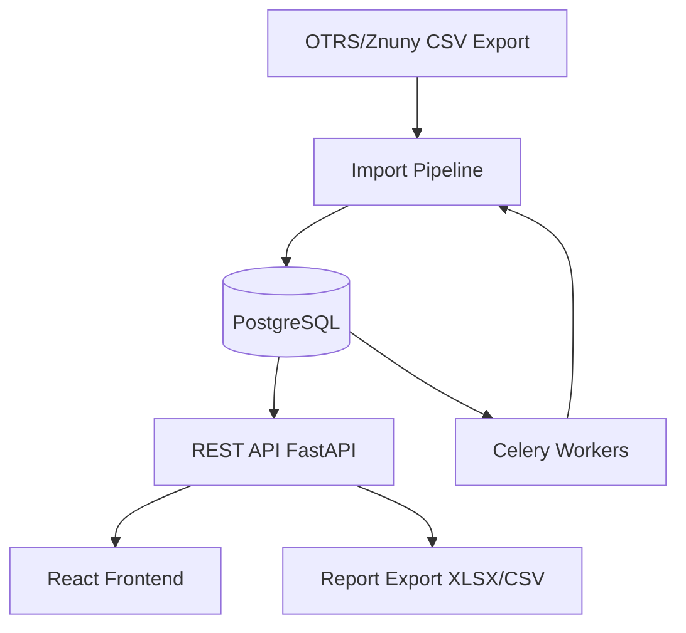
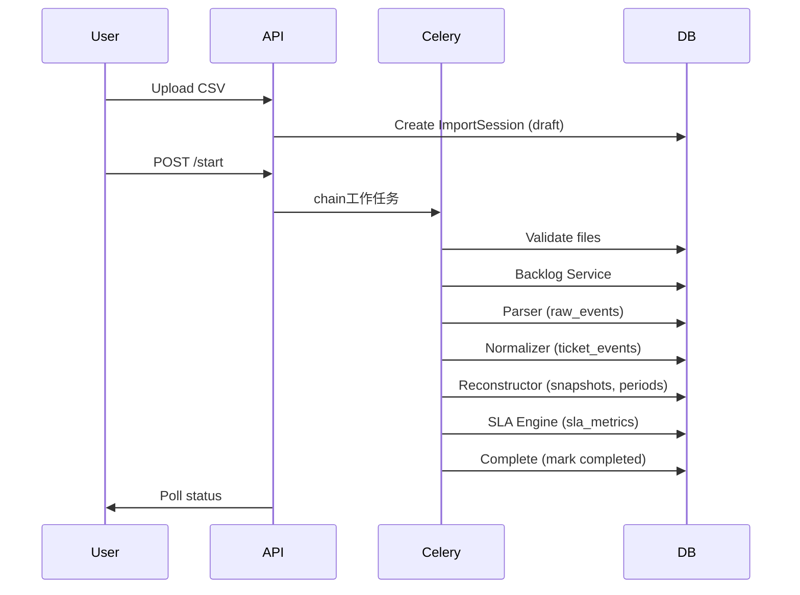

# SLA Analytics Platform

[](https://github.com/your-org/sla-analytics-platform/actions/workflows/ci.yml)
[](LICENSE)


**Enterprise-grade аналитическая платформа SLA** для систем OTRS/Znuny. 
Автоматический импорт, нормализация и SLA-аналитика на основе исторических данных.

---

## Обзор

Платформа решает ключевую задачу: **автоматизированный расчёт и мониторинг SLA** 
на основе экспортированных данных из OTRS/Znuny. 

Система импортирует backlog- и history-данные через CSV, восстанавливает полную 
историю жизни тикетов, вычисляет метрики SLA и предоставляет аналитические дашборды.



## Возможности

### 🔄 Импорт данных
- Полностью автоматический пайплайн: CSV → raw_events → нормализация → реконструкция → SLA
- Идемпотентность: повторный запуск не создаёт дубликатов
- Обнаружение и логирование неизвестных типов событий
- Дедупликация по `duplicate_key`

### ⏱️ SLA Engine
- 4 типа метрик: response_time, resolution_time, queue_time, owner_time
- Гибкие SLA-определения через очередь (queue_pattern) и приоритет
- Business hours: 24/7, рабочие дни, произвольные JSON-расписания
- Паузы при pending-статусах 
- Поддержка scoring: queue_pattern + priority prioritisation

### 📊 Дашборды и аналитика
- KPI-панель: общие метрики, SLA breach %, avg response/resolution
- Тренды по дням/неделям/месяцам
- Распределение по очередям, статусам, приоритетам, confidence
- Командная аналитика: производительность, SLA breach %, reassignments
- Queue-to-queue transitions (Sankey-диаграммы)
- Таймлайн событий и владения тикетов

### 📁 Отчёты
- XLSX и CSV экспорт
- Асинхронная генерация через Celery
- 4 типа отчётов: SLA breaches, team performance, ticket lifecycle, imports summary

### 🔍 Аудит
- Логирование всех изменений SLA-определений
- Отслеживание reprocess и import действий
- Генерация отчётов

## Архитектура

### Компоненты

```
┌─────────────────────────────────────────────────────┐
│                    Frontend (React 18)               │
│  Ant Design 5  │  ECharts  │  AG Grid  │  React Query│
└───────────────────────┬─────────────────────────────┘
                        │ REST API
┌───────────────────────▼─────────────────────────────┐
│              Backend (FastAPI, Python 3.12)          │
│  ┌──────────┐ ┌──────────┐ ┌────────────────────┐   │
│  │ API v1   │ │ Services │ │ SLA Engine         │   │
│  └──────────┘ └──────────┘ └────────────────────┘   │
└───────────────────────┬─────────────────────────────┘
                        │
┌───────────────────────▼─────────────────────────────┐
│              Database (PostgreSQL 16)                │
│  raw_events → ticket_events → ticket_snapshots      │
│  ownership_periods → queue_periods → sla_metrics   │
│  sla_definitions → teams → audit_log               │
└───────────────────────┬─────────────────────────────┘
                        │
┌───────────────────────▼─────────────────────────────┐
│           Workers (Celery + Redis)                   │
│  Import Pipeline  │  Report Generation               │
└─────────────────────────────────────────────────────┘
```

### Пайплайн импорта



## Стек технологий

| Компонент | Технология |
|-----------|-----------|
| Backend | Python 3.12, FastAPI 0.115, SQLAlchemy 2.0 async |
| Frontend | React 18, TypeScript 5.5, Vite 5 |
| UI Framework | Ant Design 5, ECharts 5, AG Grid 32 |
| Database | PostgreSQL 16 |
| Queue & Cache | Redis 7 + Celery 5.4 |
| Data Processing | Polars 1.5 (CSV parsing) |
| Export | openpyxl (XLSX), csv |
| Auth | JWT (python-jose + passlib) |
| Deployment | Docker Compose, Nginx |

## Быстрый старт

### Предварительные требования

- Docker 24+
- Docker Compose v2+

### Установка и запуск

```bash
# Клонирование репозитория
git clone https://github.com/dmtrbtc/sla-analytics-platform.git
cd sla-analytics-platform

# Настройка окружения
cp sla-platform/.env.example .env
# Отредактируйте .env при необходимости

# Запуск через Docker Compose
cd sla-platform
cp ../.env.example .env
docker compose up -d

# Применение миграций БД
make migrate

# Проверка работоспособности
curl http://localhost:8000/health

# Frontend: http://localhost
# API Docs: http://localhost:8000/api/docs
```

## Настройка окружения разработки

### Backend

```bash
cd backend
python -m venv .venv
source .venv/bin/activate  # Linux/Mac
.venv\Scripts\activate     # Windows

pip install -r requirements.txt
cp ../.env.example ../.env
# Запуск PostgreSQL и Redis через Docker:
docker compose up -d postgres redis
# Применение миграций:
alembic upgrade head
# Запуск:
uvicorn app.main:app --reload --port 8000
```

### Frontend

```bash
cd frontend
npm install
npm run dev
```

## Пайплайн импорта (детально)

### Этапы обработки

1. **Validation** — проверка наличия файлов backlog/history
2. **Backlog Load** — загрузка backlog-файла через Polars
3. **Parse** — парсинг CSV → `raw_events` (с дедупликацией и executemany bulk insert)
4. **Normalize** — трансформация `raw_events` → `ticket_events` (типизация событий, определение полей)
5. **Rebuild** — реконструкция `ticket_snapshots`, `ownership_periods`, `queue_periods`
6. **Compute SLA** — расчёт SLA метрик через SLA Engine
7. **Complete** — фиксация статуса `completed`

### Idempotency

При повторном запуске одного `import_id`:
- Удаляются все `ownership_periods` и `queue_periods` (через `ticket_snapshots.last_import_id`)
- Удаляются `sla_metrics` по `import_id`
- Удаляются `ticket_events` и `raw_events` по `import_id`
- Данные пересоздаются заново

## SLA Engine

### Метрики

| Метрика | Описание |
|---------|----------|
| `response_time` | Время от создания тикета до первого ответа (с учётом пауз) |
| `resolution_time` | Время от создания до закрытия (с учётом пауз) |
| `queue_time` | Время нахождения тикета в каждой очереди |
| `owner_time` | Время владения тикетом каждым агентом |

### Business Hours

Система поддерживает гибкие рабочие часы:
- **24/7** — круглосуточный расчёт
- **Weekday** — только рабочие дни (Пн-Пт, 9:00-18:00)
- **Custom** — произвольное JSON-расписание

### Паузы (Pause Engine)

Время в статусах `pending*` исключается из SLA-метрик, если у SLA-определения включён `pause_on_pending`.

### Правила сопоставления (Rule Engine)

SLA-определения сопоставляются с тикетами по:
1. `queue_pattern` — fnmatch-шаблон имени очереди
2. `priority` — приоритет SLA-определения
3. Algorithm: точное совпадение очереди → wildcard fallback → priority scoring

## Рекомендации по производительности

- **Индексы**: миграции 002 (`ix_sla_metrics_import_id`) и 003 (`ix_ticket_events_raw_event_id`) критичны для производительности очистки данных
- **Пайплайн**: 30k событий / ~2 минуты на полный цикл
- **Агрегация**: все дашборд-запросы используют SQL COUNT/GROUP BY, без загрузки строк в память
- **Пагинация**: все списки пагинированы

## Структура проекта

```
sla-platform/
├── backend/
│   ├── app/
│   │   ├── api/v1/          # REST API endpoints
│   │   ├── core/            # Config, DB, Celery, Security
│   │   ├── domain/          # Models, Schemas, Enums
│   │   ├── services/        # Business logic
│   │   │   ├── sla/         # SLA Engine (core)
│   │   │   ├── dashboard_service.py
│   │   │   ├── report_service.py
│   │   │   ├── audit_service.py
│   │   │   └── ...
│   │   ├── tasks/           # Celery tasks
│   │   └── utils/           # Utilities (excel writer)
│   ├── alembic/             # DB migrations
│   └── Dockerfile
├── frontend/
│   ├── src/
│   │   ├── api/             # API clients
│   │   ├── pages/           # Page components
│   │   ├── components/      # Reusable components
│   │   └── ...
│   └── Dockerfile
├── docker/                  # Nginx config, scripts
└── docker-compose.yml
```

## API Документация

После запуска доступна автоматическая документация:
- **Swagger UI**: http://localhost:8000/api/docs
- **OpenAPI JSON**: http://localhost:8000/api/openapi.json

### Основные эндпоинты

| Метод | Путь | Описание |
|-------|------|----------|
| GET | `/health` | Проверка работоспособности |
| GET | `/api/v1/dashboards/overview` | KPI дашборда |
| GET | `/api/v1/dashboards/teams` | Командная аналитика |
| GET | `/api/v1/dashboards/time-series` | Временные ряды |
| GET | `/api/v1/dashboards/ticket-flow` | Sankey-граф переходов |
| GET | `/api/v1/tickets` | Список тикетов |
| GET | `/api/v1/tickets/{id}` | Детали тикета |
| POST | `/api/v1/imports/sessions` | Создание импорта |
| POST | `/api/v1/imports/sessions/{id}/start` | Запуск пайплайна |
| GET | `/api/v1/sla/definitions` | SLA-определения |
| GET | `/api/v1/sla/metrics` | SLA-метрики |
| GET | `/api/v1/sla/breaches` | Нарушения SLA |
| POST | `/api/v1/reports/generate` | Генерация отчёта |
| GET | `/api/v1/reports/{filename}/download` | Скачивание отчёта |
| GET | `/api/v1/teams` | Команды |
| GET | `/api/v1/audit/log` | Лог аудита |

## Деплой

### Production Docker Compose

Для production-среды рекомендуется:
- Убрать `--reload` из `command` backend-сервиса
- Установить production `SECRET_KEY` в `.env`
- Настроить Nginx с SSL (см. `docker/nginx/default.conf`)
- Использовать внешнюю PostgreSQL/Redis для масштабирования

```bash
# Production запуск
docker compose -f docker-compose.yml up -d
# Бэкап базы
docker compose exec postgres pg_dump -U sla_user sla_platform > backup.sql
# Обновление
docker compose pull
docker compose up -d
```

## Дорожная карта

- [x] Phase 1: Core pipeline (CSV → events → snapshots)
- [x] Phase 2: SLA Engine (metrics, breaches, definitions)
- [x] Phase 3: Analytics, dashboards, reports, audit
- [ ] Phase 4: Тесты (unit/integration)
- [ ] Phase 5: Webhooks и интеграции
- [ ] Phase 6: Экспорт в Prometheus/Grafana

## Лицензия

MIT License. См. [LICENSE](LICENSE).

---

*Платформа разработана для OTRS/Znuny 7.2. Поддерживает импорт vCustomerTimeline CSV.*
