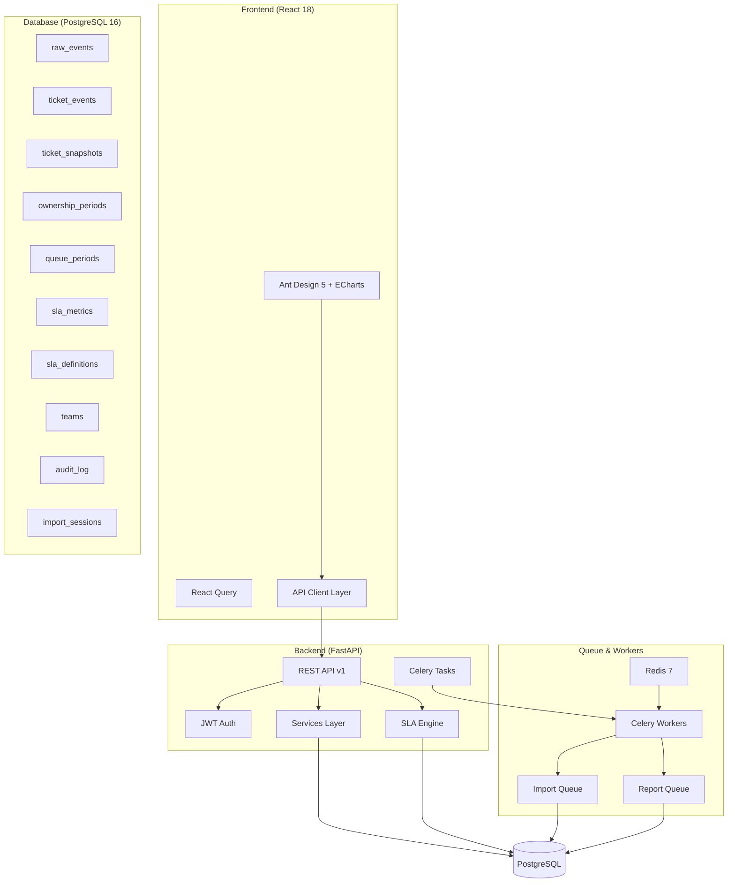
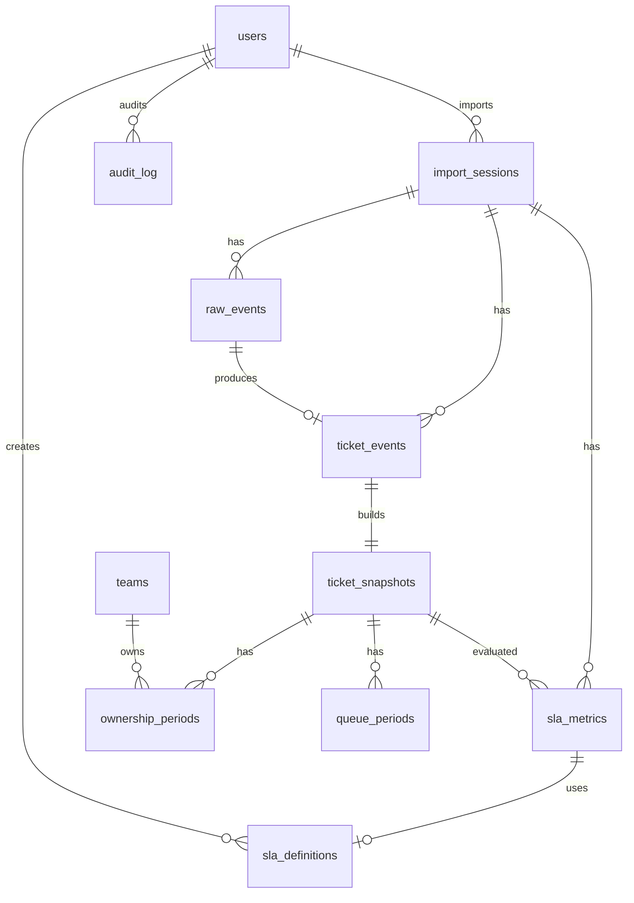
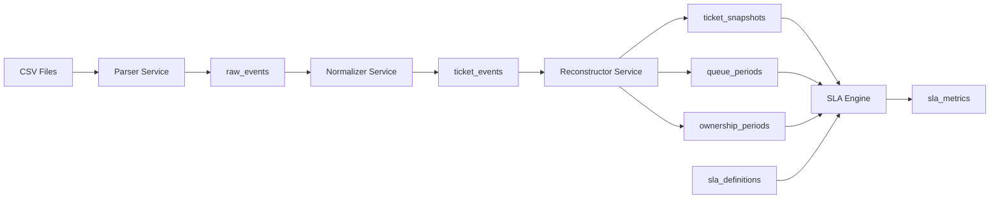
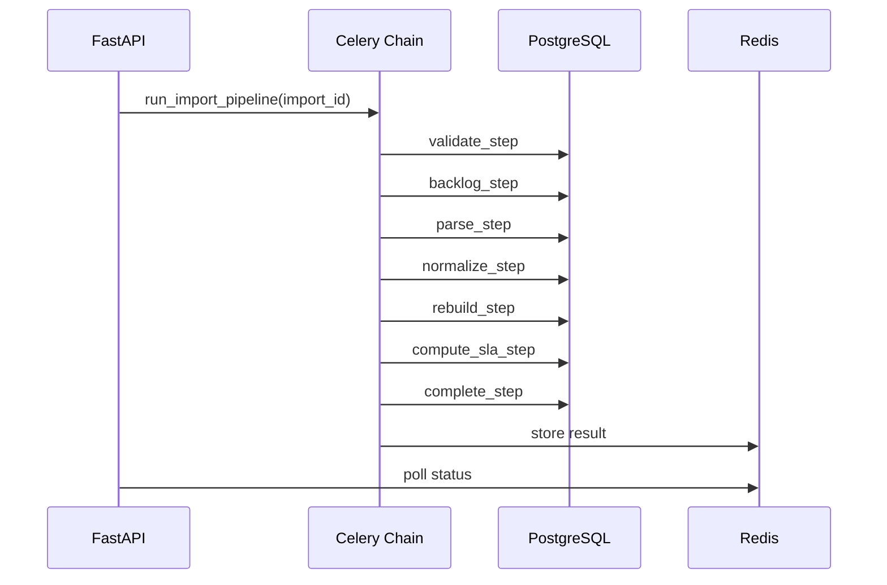
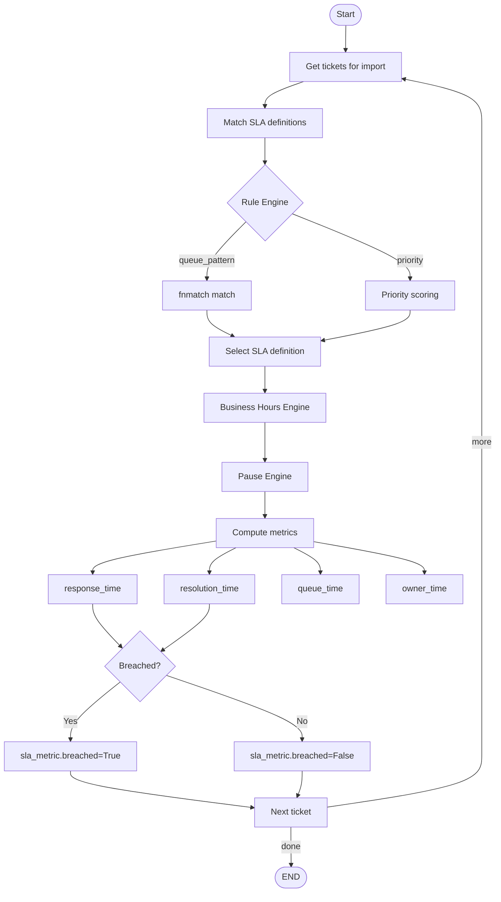

# Архитектура платформы

## Общая архитектура

## Схема базы данных

## Пайплайн обработки данных

## Celery Workflow

## SLA Computation Flow

## Компоненты SLA Engine

| Компонент | Файл | Назначение |
|-----------|------|------------|
| Business Hours | `services/sla/business_hours.py` | Определение рабочих часов (24/7, weekday, custom) |
| Pause Engine | `services/sla/pause_engine.py` | Исключение pending-времени из метрик |
| Rule Engine | `services/sla/rule_engine.py` | Сопоставление тикетов с SLA-определениями |
| Metrics Engine | `services/sla/metrics_engine.py` | Расчёт 4 типов метрик с кэшированием пауз |
| Orchestrator | `services/sla_engine.py` | Координация и идемпотентность |

## Безопасность

- JWT аутентификация с access/refresh токенами
- Password hashing через bcrypt
- Ролевая модель: admin, analyst, team_lead, viewer
- Все пароли и ключи только через переменные окружения
- CORS настройки для frontend origin
